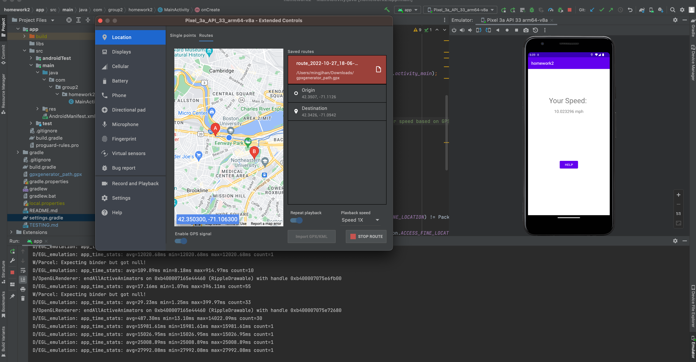

# Testing

1. Run the project in the Android studio.

2. Click option in the emulator, select GPS singal, load the `gpxgenerator_path.gpx` in our project root folder.

3. The emulator will simulate the GPS locations and show the speed.  

Result:  

# Acknowledgement

We use https://www.gpxgenerator.com/ to generate GPX file.

